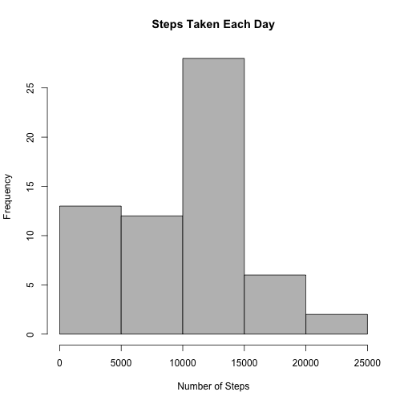
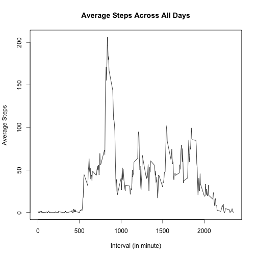
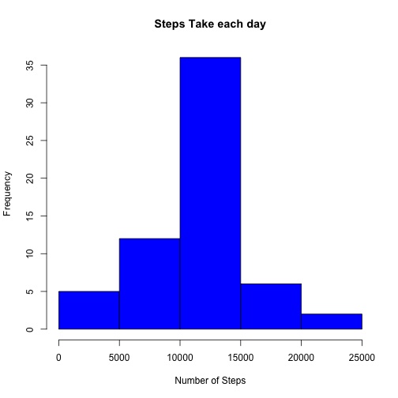
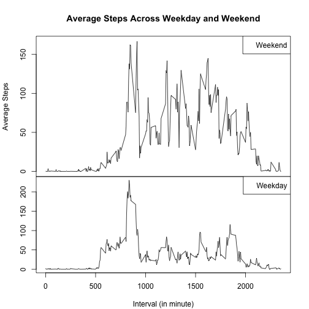

# Reproducable Research -- Peer Assignment 1

## Download data from internet

```r
##*****************************************************************##
## Download data from internet ##
##*****************************************************************##

url <- "https://d396qusza40orc.cloudfront.net/repdata%2Fdata%2Factivity.zip"
destFile <- "activityData.zip"
fileName <- "activity.csv"
if(!file.exists(fileName)){
  if(!file.exists(destFile)){
    download.file(url, destfile, mode="w", method="curl")
  }
  unzip (destfile, exdir = "./")
}
```
## Read data to a data frame 

```r
##*****************************************************************##
## read data ##
##*****************************************************************##
activityData <- read.csv(fileName, sep=",", header = TRUE, na.strings = "NA")
```
## Calculate total number of steps take for each day.

```r
##*****************************************************************##
## Calculate the total number of steps taken per day ##
##*****************************************************************##
stepsPerDay <- tapply(activityData$steps, activityData$date, sum, na.rm = TRUE)
```
## Make a histogram of the total number of steps taken each day. 

```r
##*****************************************************************##
## Make a histogram of the total number of steps taken each day ##
##*****************************************************************##
hist(stepsPerDay, xlab = "Number of Steps",
     main = "Steps Taken Each Day", col = "Gray")
```

 
## Calculate mean of the total number of setps taken per day. 

```r
##*****************************************************************##
## Calculate and report the mean and median of the total number of ## 
## steps taken per day ##
##*****************************************************************##
mean(stepsPerDay, na.rm = TRUE)
```

```
## [1] 9354.23
```
## Calculate median of the total number of steps taken per day

```r
median(stepsPerDay, na.rm = TRUE)
```

```
## [1] 10395
```
## Calculate average number of steps take per day

```r
avgSteps <- tapply(activityData$steps, activityData$interval, mean, na.rm = TRUE)
```
## Make a time series plot of the 5 minute interval and the average number of steps taken per day.

```r
##*****************************************************************##
## Make a time series plot (i.e. type = "l") of the 5-minute interval ##
## (x-axis) and the average number of steps taken, averaged across all ##
## days (y-axis) ##
##*****************************************************************##

plot(unique(activityData$interval), avgSteps, typ="l", 
     ylab = "Average Steps", xlab = "Interval (in minute)",
     main = "Average Steps Across All Days")
```

 
## The interval (in minute) with maximum number of steps

```r
##*****************************************************************##
## Which 5-minute interval, on average across all the days in the ##
## dataset, contains the maximum number of steps? ##
##*****************************************************************##
names(which.max(avgSteps))
```

```
## [1] "835"
```
## Total number of missing values in dataset (i.e the total number of rows with NAs)

```r
##*****************************************************************##
## Calculate and report the total number of missing values in the dataset ## 
## (i.e. the total number of rows with NAs) ##
##*****************************************************************##
sum(is.na(activityData$steps))
```

```
## [1] 2304
```

```r
##*****************************************************************##
## 2. Devise a strategy for filling in all of the missing values in the dataset. ##
## The strategy does not need to be sophisticated. For example, you could use ## 
## the mean/median for that day, or the mean for that 5-minute interval,etc. ##
##*****************************************************************##

##*****************************************************************##
## 3. Create a new dataset that is equal to the original dataset but with ## 
## the missing data filled in. ##
##*****************************************************************##
```
## Copy data frame to new data frame. 

```r
activityData_New <- activityData
```
## Fill missing NAs in new dataset with the average steps calculated above. 

```r
##*****************************************************************##
## is.na(activityData_New $steps) generates logical vector equel in length as ## 
## activityData_New$steps, so I use this logical vector to determine which are ## 
## NAs and fill them with corresponding average steps that was calculated and stored ## on acgSteps. ##
##*****************************************************************##
activityData_New$steps[is.na(activityData_New $steps)] <- avgSteps
```

## Make a histogram of the total number of steps taken each day

```r
stepsPerDay_New <- tapply(activityData_New$steps, activityData_New$date, sum)
hist(stepsPerDay_New, xlab = "Number of Steps",
     main = "Steps Take each day", col = "Blue")
```

 
## Mean of total number of steps taken per day after filling NAs.

```r
mean(stepsPerDay_New)
```

```
## [1] 10766.19
```
## Medina of total number of steps taken per day after filling NAs

```r
median(stepsPerDay_New)
```

```
## [1] 10766.19
```
## Create new field that tells whether date is weekend or weekday.

```r
##*****************************************************************##
## Create a new factor variable in the dataset with two levels – ## 
## “weekday” and “weekend” indicating whether a given date is a weekday ## 
## or weekend day. ##
##*****************************************************************##

activityData_New$days <- weekdays(strptime(activityData_New$date, format = "%Y-%m-%d"))
activityData_New$weekDays <- rep('weekday', length(activityData_New$days))

for (i in 1:length(activityData_New$days))
{
  if (activityData_New$days[i] %in% c('Saturday', 'Sunday'))
    activityData_New$weekDays[i] <- 'weekend'
}
```
## Calculate average number of steps taken, averaged across all weekday days or weekend days .

```r
avgSteps_WeekDays <- tapply(activityData_New$steps, activityData_New[,c('interval', 'weekDays')], mean)
```
## Draw panel plot showind weekend and weeekdsys info. 

```r
##*****************************************************************##
## Make a panel plot containing a time series plot (i.e. type = "l") ## 
## of the 5-minute interval (x-axis) and the average number of steps taken, 
## averaged across all weekday days or weekend days (y-axis). ##
## See the README file in the GitHub repository to see an example of what ## 
## this plot should look like using simulated data. ##
##*****************************************************************##

layout(matrix(1:2, ncol = 1), widths = 1, heights = c(2,1.5), respect = FALSE)
par(mar = c(0, 4.1, 4.1, 2.1))
with(activityData_New, plot(unique(activityData_New$interval), avgSteps_WeekDays[,'weekend'], typ="l",ylab = "Average Steps", xaxt = 'n', 
     main = "Average Steps Across Weekday and Weekend"))
legend("topright",legend="Weekend")
par(mar = c(4.1, 4.1, 0, 2.1))
with(activityData_New, plot(unique(activityData_New$interval), avgSteps_WeekDays[,'weekday'], typ="l",
ylab = "", xlab = "Interval (in minute)",
     main = ""))
legend("topright",legend="Weekday")
```

 

