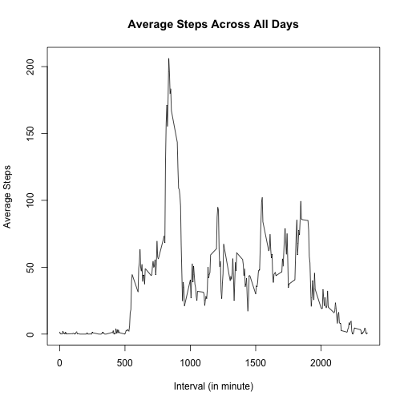
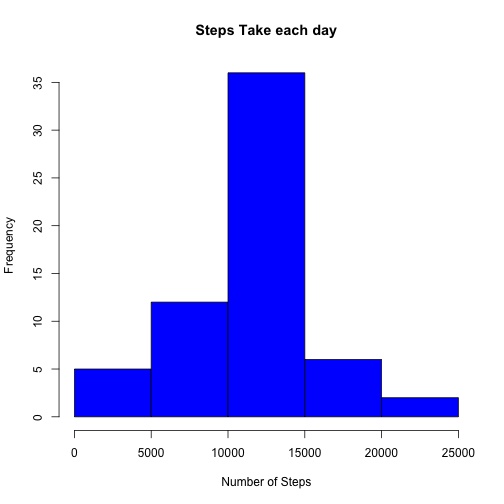
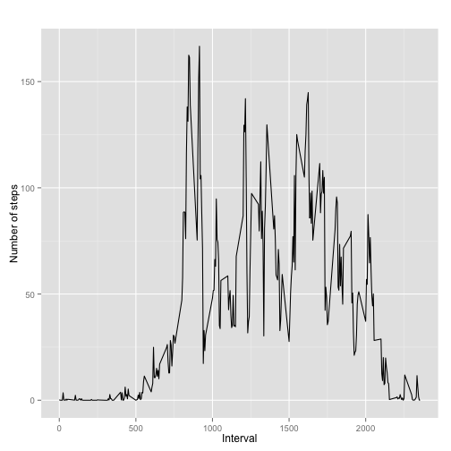

# Reproducable Research -- Peer Assignment 1

## Download data from internet

```r
##*****************************************************************##
## Download data from internet ##
##*****************************************************************##
```

```r
url <- "https://d396qusza40orc.cloudfront.net/repdata%2Fdata%2Factivity.zip"
destFile <- "activityData.zip"
fileName <- "activity.csv"
if(!file.exists(fileName)){
  if(!file.exists(destFile)){
    download.file(url, destfile, mode="w", method="curl")
  }
  unzip (destfile, exdir = "./")
}
```
## Read data to a data frame 

```r
##*****************************************************************##
## read data ##
##*****************************************************************##
activityData <- read.csv(fileName, sep=",", header = TRUE, na.strings = "NA")
```
## Calculate total number of steps take for each day.

```r
##*****************************************************************##
## Calculate the total number of steps taken per day ##
##*****************************************************************##
stepsPerDay <- tapply(activityData$steps, activityData$date, sum, na.rm = TRUE)
```
## Make a histogram of the total number of steps taken each day. 
 
## Calculate mean of the total number of setps taken per day. 

```
## [1] 9354.23
```
## Calculate median of the total number of steps taken per day

```
## [1] 10395
```
## Calculate average number of steps take per day

```r
avgSteps <- tapply(activityData$steps, activityData$interval, mean, na.rm = TRUE)
```
## Make a time series plot of the 5 minute interval and the average number of steps taken per day.
 
## The interval (in minute) with maximum number of steps

```
## [1] "835"
```
## Total number of missing values in dataset (i.e the total number of rows with NAs)

```
## [1] 2304
```
## Copy data frame to new data frame. 

```r
activityData_New <- activityData
```
## Fill missing NAs in new dataset with the average steps calculated above. 

```r
activityData_New$steps[is.na(activityData_New $steps)] <- avgSteps
```

## Make a histogram of the total number of steps taken each day
 
## Mean of total number of steps taken per day after filling NAs.

```
## [1] 10766.19
```
## Medina of total number of steps taken per day after filling NAs

```
## [1] 10766.19
```
## Create new field that tells whether date is weekend or weekday.

```r
##*****************************************************************##
## Create a new factor variable in the dataset with two levels – ## 
## “weekday” and “weekend” indicating whether a given date is a weekday ## 
## or weekend day. ##
##*****************************************************************##

activityData_New$days <- weekdays(strptime(activityData_New$date, format = "%Y-%m-%d"))
activityData_New$weekDays <- rep('weekday', length(activityData_New$days))

for (i in 1:length(activityData_New$days))
{
  if (activityData_New$days[i] %in% c('Saturday', 'Sunday'))
    activityData_New$weekDays[i] <- 'weekend'
}
```
## Calculate average number of steps taken, averaged across all weekday days or weekend days .

```r
avgSteps_WeekDays <- tapply(activityData_New$steps, activityData_New[,c('interval', 'weekDays')], mean)
```

## Plot weekend and weekdays data.
### Load ggplot2 library for qplot()

```r
library(ggplot2)
```
### Plot weekdays data
 
### Plot weekend data
 
